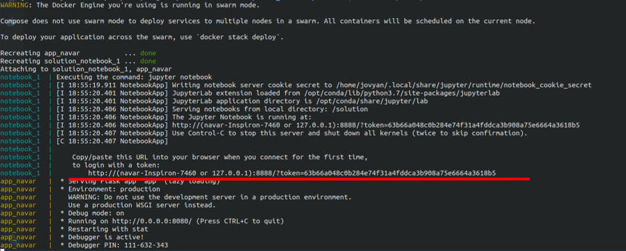

# Setup-the-data-folder

If you desire to run the analyses you **MUST** setup the data folder as follows, before doing anything else.

Download the data in this [link](https://drive.google.com/open?id=1-oG5-kBt9xQ3Li4PEexpiA9_7RZhRM1f) and unzip it inside the **data** directory. The structure should be maintained like this:


    ├── data
        ├── raw                    <- Data from the link above.
            ├── winequality.csv    <- Wine's data csv.

# How to install?

You can do it by using the [Docker option](#by-using-docker) or [Manually installing dependencies on Python 3.6](#by-manually-installing).

## By using docker

You may not want to install everything by hand. It is not that hard, but you just may not want it. If so, you can use docker to faster deploy the service and see the results in a containerized set of notebooks.

**Requirements: Install docker first!**: 1 - [install docker CE according to you OS](https://docs.docker.com/install/linux/docker-ce/ubuntu/). 2 - [install docker compose](https://docs.docker.com/compose/install/).

Build the image and run the image. Use `docker-compose` to in two lines build and run both services, the notebook mirror and the rest api.

```shell
docker-compose build
docker-compose up 
```

There is a `MAKEFILE` which automates the processes. Use:
- `make build` to build all containers at once (the notebook and the API); 
- `make notebook` to run the notebok inside a docker container;

### The jupyter notebook

Go to [http://127.0.0.1:8888](http://127.0.0.1:8888) to bring up a jupyter notebook interface inside the solution. You might need to autenticate your usage the first you build it. To do it, copy the **token** given in the shell as exhibited bellow:



And it is all set :)

> WARNING: the data folder [must be set](#setup-the-data-folder) since it is not inserted inside the consider, rather it is mapped to the local volume.

### The API

Go to [http://localhost:4748](http://localhost:4748) in which is the landing page for the api. 

How to use it:

Send a [`JSON` like this one](src/test_input.json), through a HTTP POST request, to **localhost:4748/api/predit**. It should return a `JSON` in the folowing format:

```javascript
    {
        "prediction": "good", 
    } 
```
You can see it working on the browser by accessing [http://localhost:4748/api/test/predict](http://localhost:4748/api/test/predict)

## By manually installing

Actually, it is not that hard. Just follows the steps.

1. Setup the enviroment

The `Python 3.6` has been used to develop any scripts or notebook inside this repo. To ensure operability, create an enviroment and activate it as follows:

```shell
virtualenv -p python3.6 .env
source .env/bin/activate
pip install -r requirements.txt
```

2. To read/see the analyses: open the jupyter notebook

If you did not have jupyter refer to this [documentation](https://jupyter.readthedocs.io/en/latest/install.html#new-to-python-and-jupyter). If you do, run inside the main folder.

``` shell
jupyter notebook
```
You may also use [jupyter lab](https://blog.jupyter.org/jupyterlab-is-ready-for-users-5a6f039b8906), which is more beautiful and powerfull. But, do as you like.

3. To start the API

```shell
python app.py
```

You may also pass the `--port` parameter to set the port for the server to listen.

Go to [http://localhost:1313](http://localhost:1313) in which is the landing page for the api. 

How to use it:

Send a [`JSON` like this one](src/test_data.json), through a HTTP POST request, to **localhost:1313/api/predit**. It should return a `JSON` in the folowing format:

```javascript
    {
        "prediction": "good", 
    } 
```

# Data analyses

Most of the findigs are inside the notebooks. They are:
 - [Analyses 01](notebooks/analyses-01.ipynb): it contains the statistical sampling of the out-of-sample test data. 10% of data is held to out to used only onced, before model deployment. Stratified cross-validation has been used. Two chunks of the original dataset are generated here: `winequality_10.csv` and `winequality_90.csv`.

  - [Analyses 02](notebooks/analyses-02.ipynb): The exploratory analyses are made here! Incosistences have been cleaned as well. We also highlight the most relevant features, which are: `alcohol` and `volatile acidity`. We used two techniques: ANOVA and Random Forest, and by that we ratifies our initial hypothesis that the feature `type` ought to be removed from the model development, since it could add human bias towards the classification.

  - [Analyses 03](notebooks/analyses-02.ipynb): This is the model selection notebook. We make use of several classiers, that have different point of views. We went have risen different hypothesis of features and during our experiments the best model was Random Forests, which its hyperparameters were chosen using Random Search. We also proposed to group the wine's quality as **bad** or **good**. Some of results are:
  
  > Due to space under the github repository the model was uploaded [here](https://drive.google.com/drive/folders/15JqGRLCNupVsvlqc6oSu1tMfyQ_rcnXI?usp=sharing). Downlowad it and place under the `models` dir.

  **random_forest_1000est_2leaf_depth40**

|           | acc    | recall | precision | f1     |
|:---------:|--------|--------|-----------|--------|
| Bad | 0.75   | **0.76** | **0.80**    | 0.78 |
|  Goog | 0.88   | **0.89** | **0.86**    | 0.88 |
|  average  | 0.84   | 0.84 | 0.84    | 0.84 |


**random_forest_1000est_2leaf_depth40**

| True/Pred | Assinante | Cancelou |
|:---------:|:---------:|:--------:|
| **Assinante** |   **179**  |    57   |
|  **Cancelou** |    46   |   **362**   |


# Answers to questions

### a. Como foi a definição da sua estratégia de modelagem?

Primeiramente, separei um amostra de 10% dos dados, considerando distribuição entre as classes, para o conjunto de teste, que será utilizado para aferir a REAL métrica do modelo, antes de realizar deployment. O restante de 90% foi utlizando nos passos adiante (essa parte encontram-se no notebook [Analyses 01](notebooks/analyses-01.ipynb)). Segui realizando uma análise exploratório nos dados. Encontrei inconsistências no *dataset*, como NaN, *outliers* e números representadas por strings. Montei um pipeline para tratamento dos dados e procurei encontrar padrões no conjunto, utilizando correlação e rankeamento de atributos com teste estatístico ANOVA e Árvore de decisões (essas análises encontram-se no notebook [Analyses 02](notebooks/analyses-02.ipynb)) e o código fonte do pipeline está [aqui](src/), veja o readme para maiores detalhes).

Assim, lancei mão de diferentes classificadores, utilzando técnica de validação cruzada de *random search* para otimização dos hiperparâmetros. Por fim, utilizei o pipeline gerado e o modelo treinado para aferir as métrcias no conjunto de teste. (essa parte está no notebook [Analyses 03](notebooks/analyses-03.ipynb)).


### b. Como foi definida a função de custo utilizada?

Bom, escolhi abordar o problema da ótica de classificação e não regressão. A função custo utilizada para otimição é inerente ao modelo, por exemplo, nos testes com a MLP utilizei a *cross-entropy*. Entretanto as métricas utilizadas foram: acurácia, recall e precision.

#### c. Qual foi o critério utilizado na seleção do modelo final?

Para escolher qual classificador utilizar, a acurácia foi estabelecida como baseline. Após essa etapa transformei o problema em classificação binária e a partir daqui as análises levam em consideração precision e recall, também. Visto que o conjunto de dados é desbalanceado. A seleção final do modelo ficou entre MLP e Random Forest (RF), no qual o RF foi superior em todas as métricas.


### d. Qual foi o critério utilizado para validação do modelo? Por que escolheu utilizar este método?

Durante a etapa de seleção de classificador e definição de hiperparâmetros utilizei 10-fold de cross validation. Visto que é uma forma eficaz de realizar uma simulação de Monte-Carlo não exaustiva. Porém, essa não são as métricas que reporto do meu modelo. Como citei anteriormente, separei 10% dos dados para *out-of-sample* dataset, visando tornar o experimento estatisticamente independente do processo de validação cruzada. Pense que nesse conjunto de dados como um conjunto novo, nunca visto e livre de viés de amostragem.

### e. Quais evidências você possui de que seu modelo é suficientemente bom?

O processo de validação supracitado é mais trabalho do que apenas realizar validação cruzada no meu modelo, porém é mais criterioso, pode de fato os resultados são em amostras interiamente independentes. Os subconjuntos de teste no processo de 10-fold são de certa forma utilizados para atualização do modelo, indiretamente, pois guiam a seleção do modelo.


